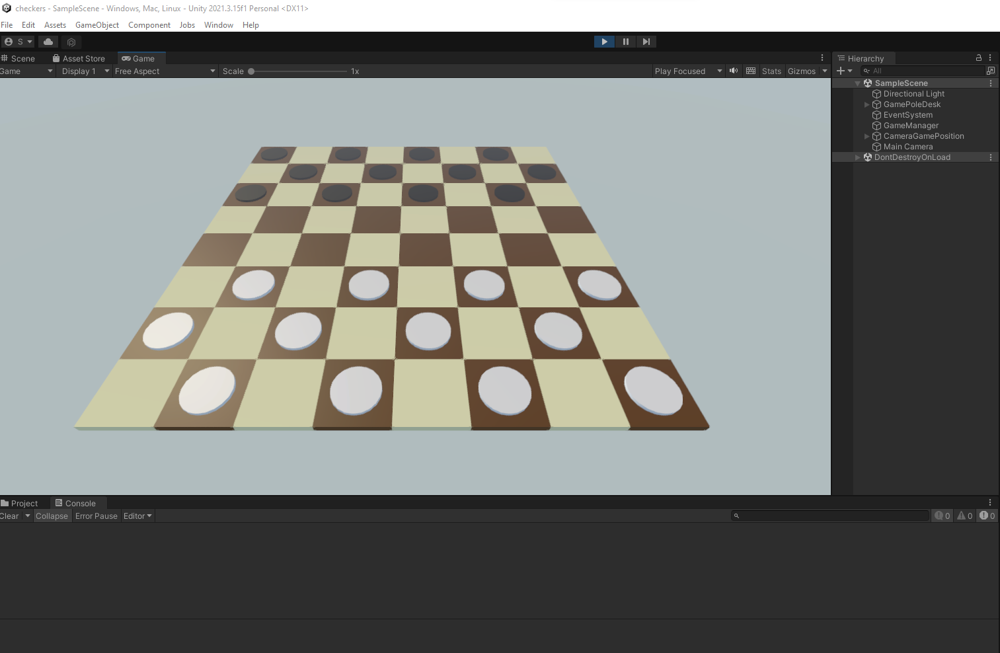
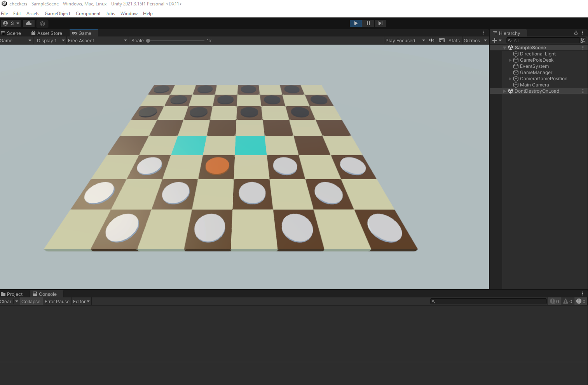
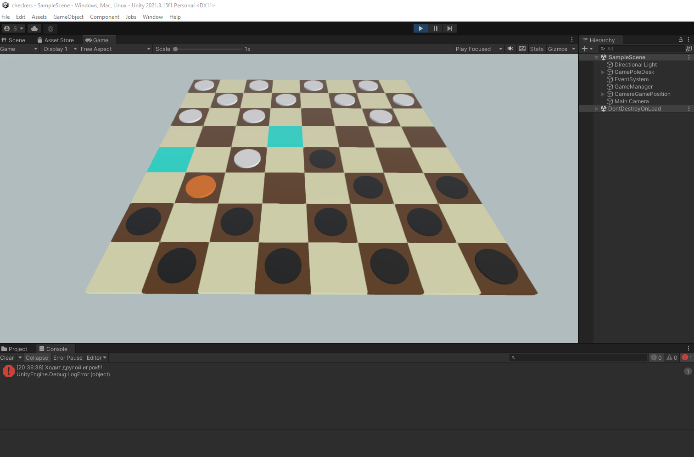

# chess_prototype
Проект: Прототип игры в шахматы.
Unity 2021.3.15
Основные реализованные моменты: 
1. логика подсветки клеток и фишек при наведении курсора и щелчку, 
2. перемещение фишек по диагоналям, 
3. создано ограничение по перемещению за поле и в занятые клетки,
4. создана возможность перешагивания фишек оппонента при их поедании,
5. если одна из фишек стала <дамкой>, то игра заканчивается победой игрока, имеющего <дамку>,
6. реализован не обязательный вариант съесть фишку.
7. создан компонент (observer), который:
    * считывает все действия игроков, а именно выбор фишек, выбор клеток для перемещения фишек и уничтожение фишек оппонента, 
    * после чего записывает эти действия в отдельный файл,
    * воспроизводит в том же порядке записанные действия, если был выбран данный режим работы в редакторе.
<table>
    <tr>
        <td>
            
        </td>
        <td>
            
        </td>
        <td>
            
        </td>
    </tr>
</table> 
